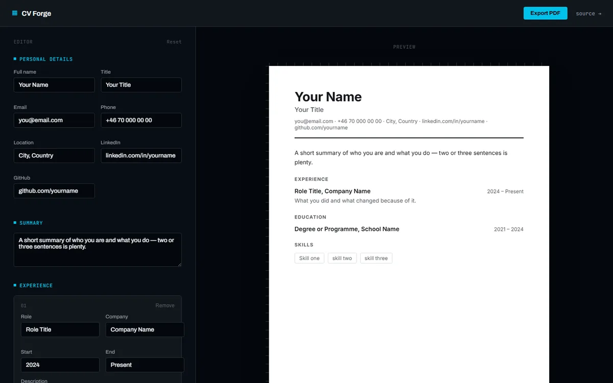

# CV Forge

Build a resume section by section, watch it take shape on a real page as you type,
and export it straight to PDF.



## Why

A resume builder that's also genuinely useful — fill in personal details, a summary,
any number of experience and education entries, and skills, and the right-hand page
updates live. When it looks right, hit **Export PDF** for a clean, print-ready file.

## Features

- Live preview — the page on the right always reflects exactly what you'd get in the
  PDF, styled as an actual resume rather than a generic app screen
- Repeatable experience and education entries — add or remove as many as you need
- One-click PDF export via the browser's own print engine (no heavy rendering
  library, no quality loss)
- Everything is saved to `localStorage` automatically — refresh and your data is
  still there
- Keyboard-accessible, respects `prefers-reduced-motion`, responsive down to mobile

## Design

The editor chrome is a dark, technical "drafting desk" — deliberately not the same
look as the document it produces. The preview page is a real white page with ruler
guides along the top and left edges, because the thing being built is a printable
document, not just another web page.

## Stack

React 19 + TypeScript + Vite, Zustand for state (with the `persist` middleware for
`localStorage`). No backend — everything runs client-side.

## Getting started

```sh
npm install
npm run dev
```

## Build

```sh
npm run build
```
