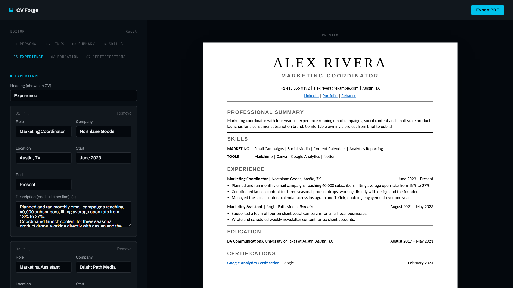

# CV Forge

Build a resume section by section, watch it take shape on a real page as you type,
and export it straight to a print-ready PDF.



## Why

A resume builder that's also genuinely useful — fill in personal details, links, a
summary, skills, any number of experience, education, and certification entries, and
the right-hand page updates live. When it looks right, hit **Export PDF** for a file
that matches the preview exactly, down to the pixel.

## Features

- **Live preview** — the page on the right always reflects exactly what you'd get in
  the PDF, styled as an actual resume rather than a generic app screen
- **Tabbed editor** — one section at a time instead of one long scrolling form, with a
  sticky tab bar to jump between them
- **Builds up as you go** — a fresh or empty section shows nothing at all, and the
  dividing lines between sections appear as you move on to the next one, so the
  preview never looks like a form full of placeholder text
- **Repeatable entries** everywhere it makes sense — links, skill categories,
  experience, education, certifications — with move up/down buttons to reorder them
  and a confirmation dialog before anything is removed
- **Customizable section headings** — rename "Skills" to whatever fits, per section
- **True PDF export**, not the browser's print dialog — generated client-side with
  `@react-pdf/renderer`, so margins and page size are exact and never depend on print
  settings. Multi-page resumes get a heads-up badge and break cleanly: a heading is
  never left orphaned at the bottom of a page, and an entry never splits mid-bullet
- **Autosaved** to `localStorage` as you type, and resilient to a corrupted save (a
  bad record falls back to a fresh resume instead of a blank white screen)
- Keyboard-accessible custom dialogs (real focus trapping, not just a styled
  `<div>`), respects `prefers-reduced-motion`, responsive down to mobile

## Design

The editor chrome is a dark, technical "drafting desk", deliberately not the same
look as the document it produces. The preview page is a real white page, because the
thing being built is a printable document, not just another web page.

## Stack

React 19 + TypeScript + Vite, Zustand for state (with the `persist` middleware for
`localStorage`), `@react-pdf/renderer` for PDF generation. No backend, everything
runs client-side.

## Getting started

```sh
npm install
npm run dev
```

## Build

```sh
npm run build
```
